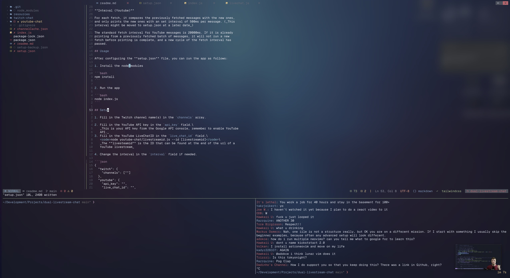

# Dual Livestream Chat in Terminal


## Why?

I often watch livestreams while programming, and using the PiP function in Arc
Browser I can have both the video and the chat of a livestream in a tmux pane.



## Docs

This is a [NodeJS](https://nodejs.org/en/) app to get chat messages from two
livestreams on Youtube and Twitch, and combining them into a terminal window.
Youtube messages are color coded in _red_, while Twitch is colored to _blue_.

> Youtube messages are controlled with an interval in the configuration file so
> that it stays within the free tier limit of the YoutTube API (10.000 credits
> in a 24 hour span). Twitch messages are streamed in real-time and has no limit
> or restrictions.

**Caching (Youtube)**

The YouTube api returns a chat object with 200 messages and there has to be made
a individual request on each message_id to find the channel name for the user
who sent the message.

User ids and channel names are cached in the **channelCache.json** file. To
avoid making unnecessary API calls, this file will be checked before every
request for a channel name when new messages comes in.

**Interval (Youtube)**

For each fetch, it compares the previously fetched messages with the new ones,
and only prints the new ones with an set interval of 500ms per message. (_This
interval might be moved to setup.json at a later date_)

The standard fetch interval for YouTube messages is 20000ms. If it is already
printing from a previously fetched batch of messages, it will not run a new
fetch before printing is complete, and a new cycle of the fetch interval has
passed.

## Usage

After configuring the **setup.json** file, you can run the app as follows:

1. Install the node_modules

```bash
npm install
```

2. Run the app

```bash
node index.js
```

## Setup

1. Fill in the Twitch channel name(s) in the `channels` array.

2. Fill in the YouTube API key in the `api_key` field.\
   _This is your API key from the Google API console, remember to enable YouTube
   API._
3. Fill in the YouTube LiveChatID in the `live_chat_id` field.\
   <code>node youtube-chat/livestreamid.js --id [livestreamid]</code>\
   _The **livesteamid** is the ID that can be found at the end of the url of a
   YouTube livestream_

4. Change the interval in the `interval` field if needed.

```json
{
  "twitch": {
    "channels": [""]
  },
  "youtube": {
    "api_key": "",
    "live_chat_id": "",
    "interval": 20000
  }
}
```
